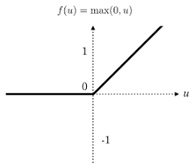

# SVM_hinge python package V1.0
- The package is python package that uses SVM model on binary Classification  
- The package uses subgradient descent on both hinge loss ,and first norm requalize making it converaging better on different datasets 

## System 
Python 3

## SubGradient descent
it's a extension of gradient descent that deals with function that not differentiable at point(s) by making slope a value in the range of nearby slopes

example of it SVM hinge loss ,and ***first norm regualize, which is the regualize used here***

## SVM
 - SVM is “primarily”  a classification algorithm ,that works by classifying 2 classes data by making line or surface between the 2  classes
 - Can be used in regression (but not covered here)
 - For more than classes ,one can use techniques like One-vs-all (one vs rest) ,or one-vs-one
- Typically classes are assumed labelled -1,1 
- ***This version requires y to be binary classification only 1 /1***
- SVM can be numeric or non numeric (as sklearn),this package provide the numeric approach as it converage faster using hinge loss
***This version uses typical gradient descent***

### Hinge loss
For SVM in numeric Hinge Loss is used which is :
WtX+b>=1 ,y=1
WtX+b<=1 ,y=-1

And so all follow: y(WtX+b)>=1
So : 1- y(WtX+b)<=0

This value is real and true for points which model have been truly classified 
So positive for misclassified data
To produce loss function (error in one point) we need that value ,and if true we don’t have error  so loss is max(0, 1- y(WtX+b))

So the loss function (error in one point) is :

max(0, 1- y(WtX+b))

Where Wt,X is arraies for w1,x1 .. So on ,equivalent to w1x1+w2x2….

the cost function used in the algorithm :

## Usage :

install
pip install git+https://github.com/TahaFawzyElshrif/SVM_hinge.git

`
from SVM_hinge import SVM_hinge
model=SVM_hinge()
model.fit(X_train,y_train,lring_rate=.01,num_iters=500,lambada=.7)
y_pred=model.predict(X_train)
`

also the testing on data has been shown in the ipynp file test

### Thanks to 
- Dr Amr Amin who teached me the course
- Andrew ML course (for code structure)
